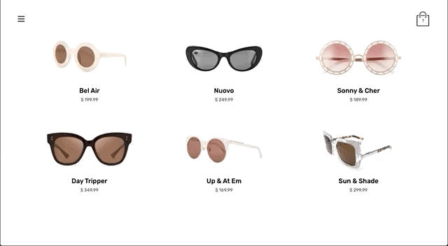

# Sol Sunglasses Ecom 

A full stack Node.js and React shopping cart app

## Live Demo

https://sol-sunglasses.adambotma.com/

## Technologies Used
  * ReactJS
  * CSS3
  * HTML5
  * Node.js
  * PostgreSQL

## Functionality Overview 
  * User can view the front page 
  * User can navigate via the Menu Drawer
  * User can view all products available
  * User can view a product's detail page
  * User can add an item to their Shopping Bag
  * User can view their Shopping Bag
  * User can checkout and place an order
  

## Further Development Plans 
* Add image carousel to product details page to show multiple product images.
* Re-style the product listing page to have a more magazine style layout. 
* Create functionality for users to remove items from their cart. 
* Improve mobile layout for the view cart page.
* Improve empty cart page

## Screenshots

Homepage View:

Product Pages:

